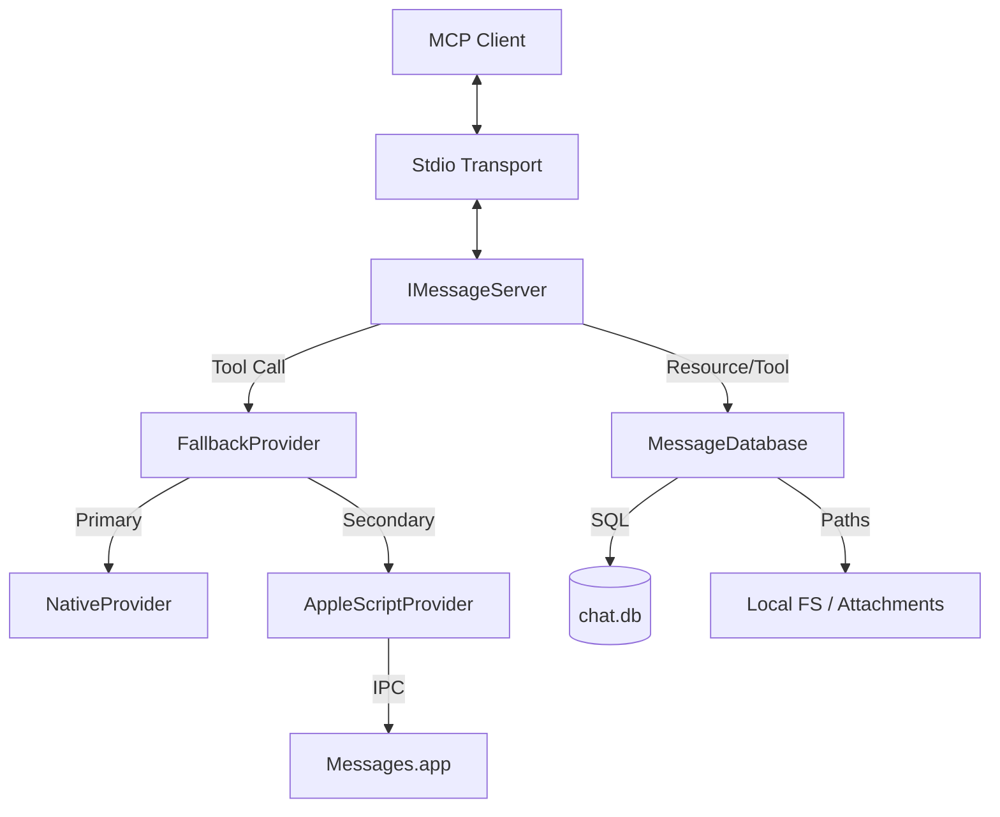

# Architecture & Design

The iMessages MCP Server is built with a modular, service-oriented architecture designed for reliability and security on macOS.

## System Architecture

The server consists of five core layers, each with a specific responsibility:

1.  **Transport Layer (stdio)**: Uses JSON-RPC 2.0 over standard I/O to communicate with the MCP client. This layer is handled by the `@modelcontextprotocol/sdk`.
2.  **Server Logic Layer (`index.ts`)**: Orchestrates the server lifecycle, registers tools and resources, and maps incoming requests to service calls.
3.  **Messaging Provider Layer (`providers/`)**: A modular backend for sending messages. It uses a **Fallback Strategy** to prioritize performance (Native) while maintaining reliability (AppleScript).
4.  **Database Layer (`db.ts`)**: Provides a high-performance, read-only interface to the macOS `chat.db` using `better-sqlite3`.
5.  **Diagnostics Layer (`permissions.ts`)**: Performs non-invasive empirical tests to verify TCC (Transparency, Consent, and Control) permissions.

## Key Design Patterns

### 1. The Provider Pattern (Messaging)
To decouple the tool logic from the complexities of macOS IPC, the server implements a `MessagingProvider` interface. 
- **`FallbackProvider`**: The primary orchestrator. It executes providers in a prioritized sequence.
- **`AppleScriptProvider`**: Implements **Exponential Backoff** (3 retries: 1s, 2s, 4s) and **Self-Healing** (auto-detects if Messages.app is running and re-launches it if necessary).
- **`NativeProvider`**: A future-proof hook for high-performance IMCore integration.

### 2. Read-Only Database (Pragmas & Safety)
The database is accessed with strict safety measures:
- `immutable=1` and `query_only=1` to prevent any writes.
- `journal_mode=WAL` support to allow reading while Messages.app is writing.
- `synchronous=OFF` for maximum read performance during high-volume queries.

### 3. TOON v3.0 Encoding
The server implements a custom encoder for the **Token-Oriented Object Notation**.
- **Tabular Mapping**: Collections of objects are converted into a header-prefixed format (e.g., `messages[50]{guid,text,...}:`).
- **Context Optimization**: By removing redundant JSON keys, we achieve a ~50% reduction in token usage, allowing the AI to see more message history.

## Data Flow

