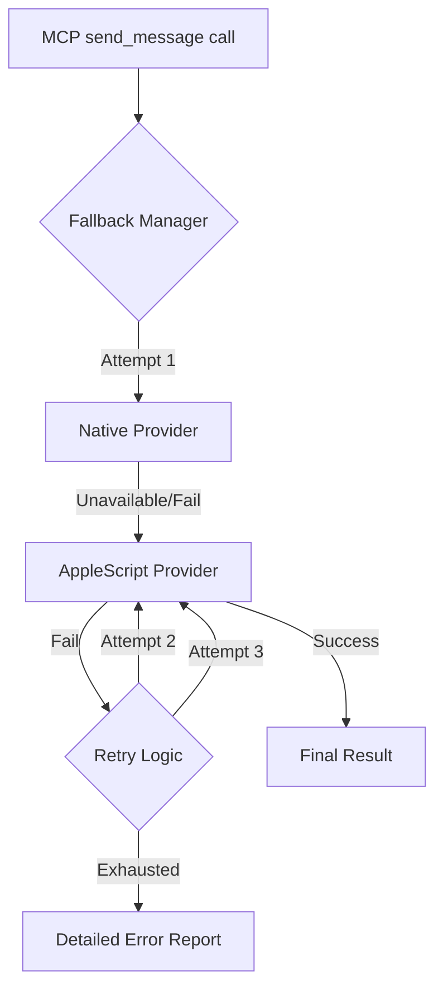

# Architecture & Design

The iMessages MCP Server is built with a modular, service-oriented architecture designed for reliability and security on macOS.

## System Architecture

The server consists of several core layers:

1. **MCP Transport Layer**: Handles communication with the MCP client (e.g., Claude Desktop) via Standard Input/Output (stdio).
2. **Service Layer**: Orchestrates logic between the MCP protocol and macOS-specific operations.
3. **Database Abstraction Layer (`db.ts`)**: Provides read-only access to the SQLite `chat.db`. It handles complex joins for attachments and thread resolution.
4. **AppleScript Engine (`applescript.ts`)**: Manages inter-process communication with the native Messages.app for sending content.
5. **Permissions Guardian (`permissions.ts`)**: Performs empirical tests to verify TCC permission status and system health.

## Key Design Patterns

- **Read-Only Database**: The server opens `chat.db` in `immutable` / `query_only` mode to prevent database corruption and minimize locking conflicts with the Messages app.
- **Exponential Backoff**: Implements a synchronous retry mechanism for database locks, ensuring stability when the Messages app is actively writing.
- **Normalization**: Automatically cleans and formats phone numbers and identifiers before processing, reducing delivery failures.
- **Token Efficiency**: Custom TOON encoder serializes data into a tabular format, significantly reducing the token footprint for AI agents.

## Messaging Architecture: The Provider Pattern

To ensure reliability across different macOS security environments, the server implements a **Provider Pattern** for message delivery. This decouples the MCP tool logic from the specific implementation details of sending a message.

### 1. Provider Orchestration
The server uses a `FallbackProvider` to manage multiple messaging backends:
- **Primary: Native IMCore (`NativeProvider`)**: Targeted at high-performance delivery using Apple's private frameworks. Currently a placeholder that returns a clear path for future implementation (requires SIP bypass).
- **Secondary: Enhanced AppleScript (`AppleScriptProvider`)**: The robust default. It uses macOS's native IPC to control the Messages app.

### 2. Resilience & Self-Healing
The `AppleScriptProvider` is engineered for high reliability:
- **Auto-Recovery**: Automatically detects if `Messages.app` is closed or unresponsive and re-launches it before retrying.
- **Exponential Backoff**: Implements a 3-tier retry strategy with increasing delays (1s, 2s, 4s) to handle transient system busy states or database locks.
- **Smart Filtering**: Fast-fails on non-transient errors (like missing permissions) to avoid unnecessary retries.

### 3. Data Flow with Fallback

